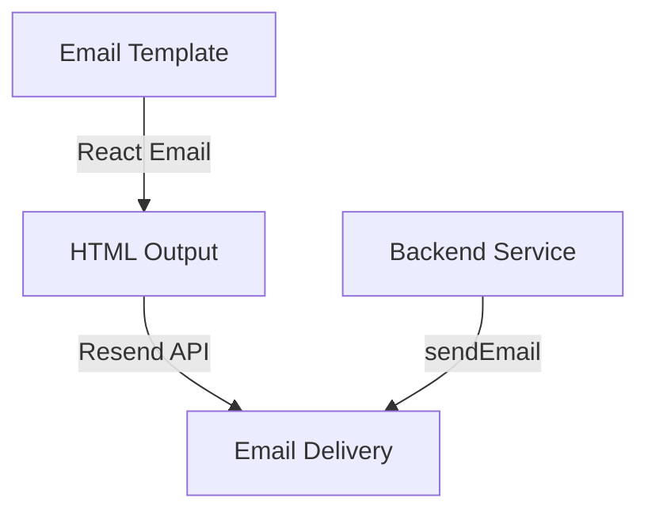

# Email System

Our application uses [Resend](https://resend.com) for sending emails and [React Email](https://react.email) for creating beautiful, responsive email templates. This guide will show you how to use both tools effectively.

## Architecture Overview



## Setup

### 1. Environment Variables

Add the following to your `.env` file:

```env
RESEND_API_KEY=re_xxxx...
```

### 2. Dependencies

```bash
npm install resend @react-email/components
```

## Creating Email Templates

### Using React Email

Create your email templates in the `apps/server/src/email-templates` directory. Here's an example:

```tsx
// apps/server/src/email-templates/welcome.tsx
import {
  Body,
  Container,
  Head,
  Heading,
  Html,
  Preview,
  Text,
} from '@react-email/components';
import * as React from 'react';

interface WelcomeEmailProps {
  username: string;
}

export const WelcomeEmail = ({ username }: WelcomeEmailProps) => (
  <Html>
    <Head />
    <Preview>Welcome to our platform!</Preview>
    <Body style={main}>
      <Container style={container}>
        <Heading style={h1}>Welcome, {username}!</Heading>
        <Text style={text}>
          We're excited to have you on board.
        </Text>
      </Container>
    </Body>
  </Html>
);

const main = {
  backgroundColor: '#ffffff',
  fontFamily: '-apple-system,BlinkMacSystemFont,"Segoe UI",Roboto,Oxygen-Sans,Ubuntu,Cantarell,"Helvetica Neue",sans-serif',
};

const container = {
  margin: '0 auto',
  padding: '20px 0 48px',
  maxWidth: '560px',
};

const h1 = {
  color: '#333',
  fontSize: '24px',
  fontWeight: '600',
  lineHeight: '40px',
  margin: '0 0 20px',
};

const text = {
  color: '#444',
  fontSize: '16px',
  lineHeight: '24px',
  margin: '0 0 20px',
};

export default WelcomeEmail;
```

## Sending Emails

### Using the Email Service

We provide a simple email service to send emails using Resend:

```typescript
// Example usage
import { sendEmail } from '@/services/email';
import WelcomeEmail from '@/email-templates/welcome';

await sendEmail({
  to: 'user@example.com',
  subject: 'Welcome to our platform',
  from: 'noreply@yourdomain.com',
  react: WelcomeEmail({ username: 'John' }),
});
```

### Email Service Implementation

The email service is implemented in `apps/server/src/services/email.ts`:

```typescript
interface SendEmailOptions {
  to: string;
  subject: string;
  text?: string;
  username?: string;
  from: string;
  react?: React.ReactNode;
  html?: string;
}

export async function sendEmail({
  to,
  subject,
  text,
  from,
  react,
  html,
}: SendEmailOptions) {
  try {
    const { data, error } = await resend.emails.send({
      from,
      to,
      subject,
      react,
      html,
    });

    if (error) {
      return error;
    }
    return {
      message: "Email sent",
      result: data,
    };
  } catch (error) {
    console.error("Failed to send email:", error);
    throw new Error("Failed to send email");
  }
}
```

## Best Practices

1. **Template Organization**
   - Keep all email templates in `apps/server/src/email-templates`
   - Use TypeScript for type safety
   - Follow a consistent naming convention

2. **Styling**
   - Use inline styles for maximum email client compatibility
   - Test emails across different email clients
   - Keep designs simple and responsive

3. **Error Handling**
   - Always implement proper error handling
   - Log email sending failures
   - Implement retry mechanisms for failed sends

4. **Testing**
   - Test email templates in development
   - Use React Email's preview feature
   - Test across different email clients

## Common Use Cases

### 1. Email Verification

```typescript

    await sendEmail({
        to: user.email,
        subject: "Verify your email",
        from: "onboarding@resend.dev",
        html: getVerifyEmailHtml(
            user.name || user.email?.split("@")[0] || "User",
             "Better Boilerplate",
            process.env.CORS_ORIGIN as string,
            token,
        ),
    });

```

### 2. Password Reset

```typescript
import { ResetPasswordEmail } from '@/email-templates/reset-password';

await sendEmail({
  to: user.email,
  subject: 'Reset Your Password',
  from: 'noreply@yourdomain.com',
  react: ResetPasswordEmail({ resetLink: resetUrl }),
});
```

## Troubleshooting

### Common Issues

1. **Emails Not Sending**
   - Check RESEND_API_KEY is correctly set
   - Verify email addresses are valid
   - Check Resend dashboard for delivery status

2. **Styling Issues**
   - Use inline styles
   - Test in multiple email clients
   - Keep designs simple

3. **Template Rendering**
   - Use React Email's preview feature
   - Check for TypeScript errors
   - Verify all props are passed correctly

## Resources

- [Resend Documentation](https://resend.com/docs)
- [React Email Documentation](https://react.email/docs)
- [Email Client Support](https://www.caniemail.com) 