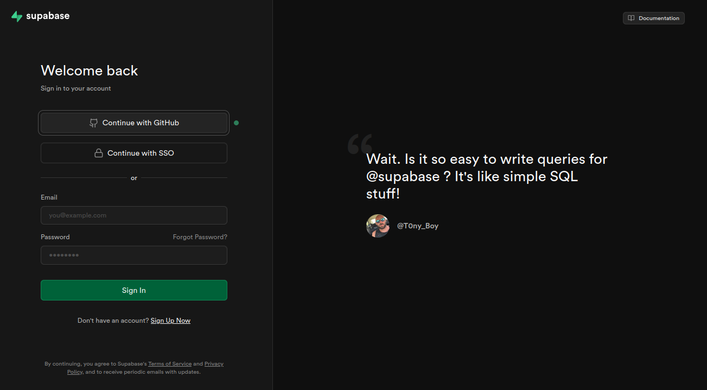
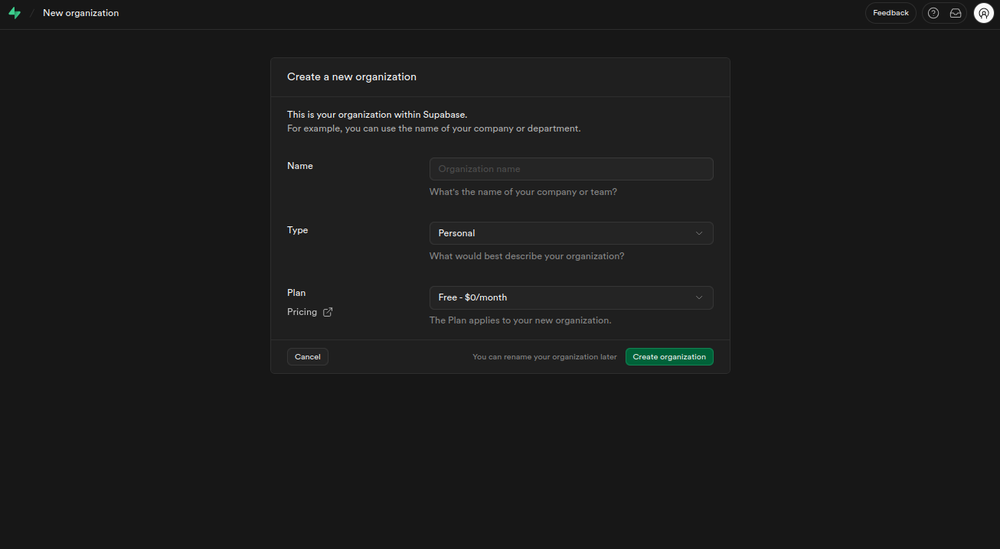
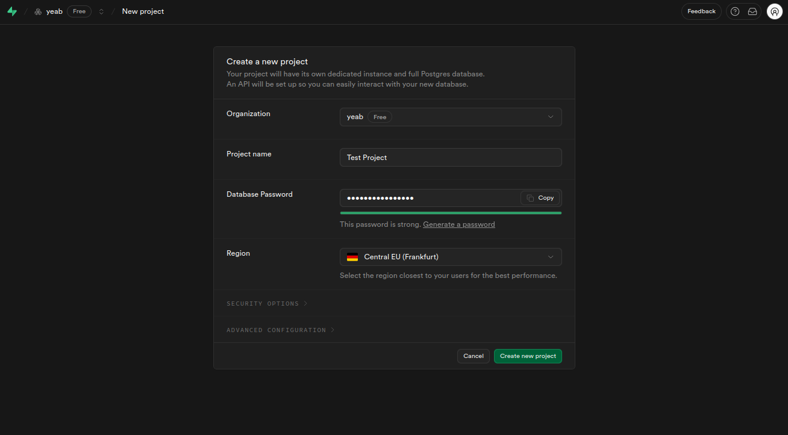
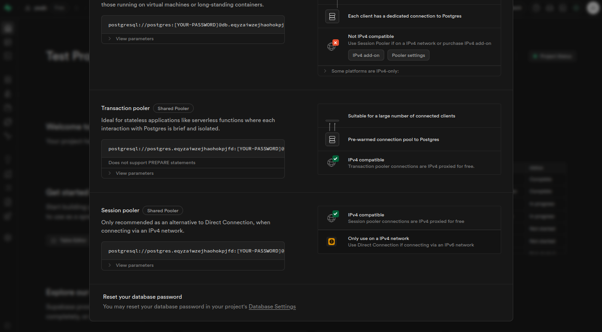
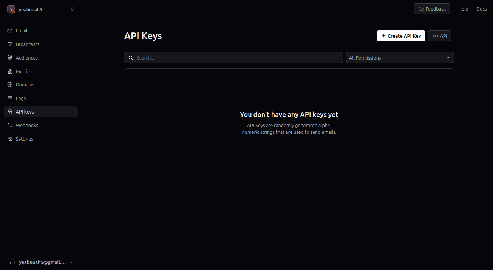
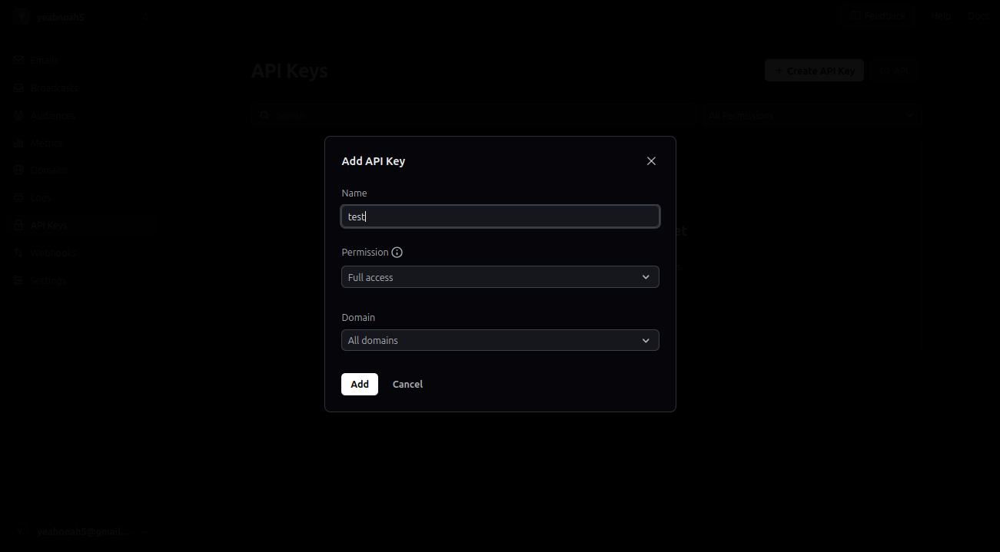
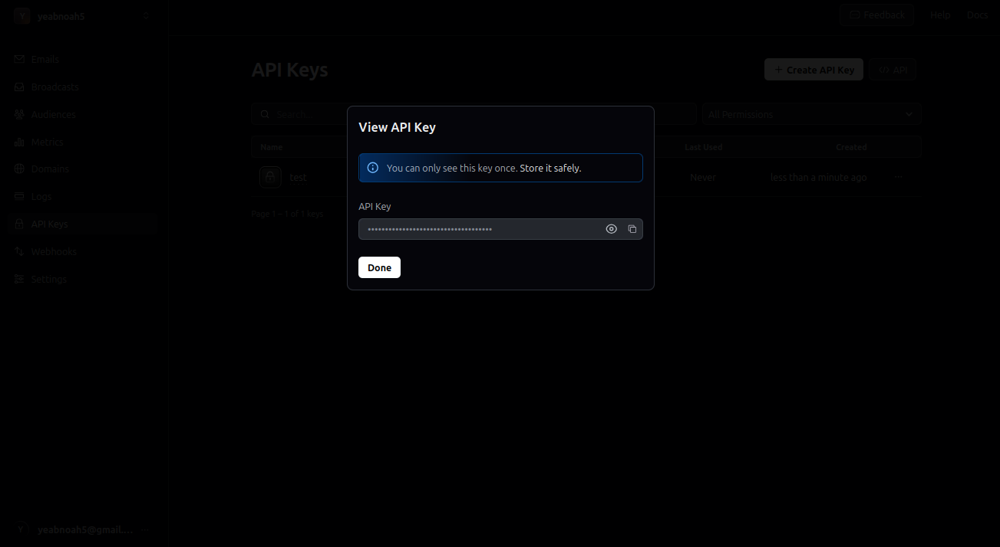

import { Tabs, TabsList, TabsTrigger, TabsContent } from "@/components/ui/tabs"

## Quick Start

Spin up your BetterBoilerplate project in minutes with this step-by-step guide.

---

### Prerequisites

Ensure the following are installed:

* [Bun](https://bun.sh) v1.0+
* Git
* [Node.js](https://nodejs.org/en) 18+ (if not using Bun)

---

### 1. Project Setup

1. Clone the repository:
   ```bash
   # Using SSH
   git clone git@github.com:Humanoidz-ai/ultimate-boilerplate-code.git
   
   # Or using HTTPS
   git clone https://github.com/Humanoidz-ai/ultimate-boilerplate-code.git
   ```
-
2. Navigate to the project directory:
   ```bash
   cd ultimate-cursor-ai-boilerplate
   ```

3. Install dependencies:
   ```bash
   bun install
   ```

---

### 2. Environment Variables

Create `.env` files from the examples:

```bash
cp apps/web/.env.example apps/web/.env
cp apps/cms/.env.example apps/cms/.env
cp apps/server/.env.example apps/server/.env
```

**Frontend (`apps/web/.env`):**

```env
NEXT_PUBLIC_SERVER_URL=http://localhost:3000
NEXT_PUBLIC_APP_URL=http://localhost:3001
PAYLOAD_PUBLIC_SERVER_URL=http://localhost:3003
```

**CMS (`apps/cms/.env`):** See steps below to fill these in.

```env
PAYLOAD_SECRET=...
DATABASE_URI=...
```

**Backend (`apps/server/.env`):** See steps below to fill these in.

---

### 3. Supabase Setup

1. Go to [Supabase](https://app.supabase.com)
 
2. Create a new organization
 
3. Create a new project; keep the Database password since we'll use it later
 
4. connect your project to the database click connect on the top center of the page
 
5. Copy:

   * `Transaction pooler`
   * `Session pooler`

Add to `apps/server/.env` respectively: 

```env
DATABASE_URL=...
DIRECT_URL=...
```

---

### 4. Authentication Setup

BetterAuth requires a secure secret key for encrypting sessions and tokens. This secret should be unique per environment and never shared.

**Generate Secret:**
1. Open your terminal
2. Run this command in your terminal to generate a random string:

```bash
openssl rand -hex 16
```

copy the output and add to `apps/server/.env` respectively:

```env
BETTER_AUTH_SECRET=...
BETTER_AUTH_URL=http://localhost:3000
CORS_ORIGIN=http://localhost:3001
```

**Google OAuth:**

1. Visit [Google Cloud Console](https://console.cloud.google.com)
2. Create project → Enable "Google+ API"
3. Set up OAuth credentials:

watch this video to set up google oauth:

<iframe width="560" height="315" src="https://www.youtube.com/embed/-vq32dsK_TI" title="YouTube video player" frameborder="0" allow="accelerometer; autoplay; clipboard-write; encrypted-media; gyroscope; picture-in-picture" allowfullscreen></iframe>

   * Origins: `http://localhost:3000`, `http://localhost:3001`
   * Redirect URI: `http://localhost:3000/api/auth/callback/google`


4. Add to `apps/server/.env`:

```env
GOOGLE_CLIENT_ID=...
GOOGLE_CLIENT_SECRET=...
```

---

### 5. Email Setup (Resend)

1. Visit [Resend](https://resend.com) → sign up
2. Create API Key → Copy it
 
 
 
3. Add to `apps/server/.env`: 

```env
RESEND_API_KEY=re_... // paste the output here
```

---

### 6. Payment Setup

1. Visit [Stripe](https://stripe.com) and login

2. Enable Test Mode (create a new sandbox) for testing and local development

   
   

3. Get your Secret Key (`sk_test_...`) and add it to `apps/server/.env`:
   ```env
   NEXT_PUBLIC_STRIPE_TEST_PRODUCT_PRICE=...
   ```

   
   

4. Create a new product in Stripe:
   - Go to Products → Add Product
   - Set up your product details and pricing
   - Copy the Price ID (starts with `price_`)
   - Add to `apps/server/.env`:
   ```env
   STRIPE_TEST_PRODUCT=...
   ```

   
   
   
   
   
   

   > BetterAuth handles subscriptions by default, so webhooks are optional but can be added for custom functionality.

5. (Optional) Set up a Stripe webhook:

   a. Start ngrok tunnel:
   ```bash
   ngrok http 3000
   ```

   b. In Stripe Dashboard:
   - Go to Developers → Webhooks → Add Endpoint
   - Enter your ngrok URL as the endpoint URL
   - Select relevant webhook events (or all events)
   - Click "Add Endpoint" to save

   
   

   c. Copy the Webhook Signing Secret and add to `apps/server/.env`:
   ```env
   STRIPE_WEBHOOK_SECRET=...
   ```

   
   


  ### 7. .env for OpenRouter 
  - go to https://openrouter.ai/settings/keys 
  - create a new api key
  - copy the api key and add to `apps/server/.env`

  ```env
  OPENROUTER_API_KEY=...
  ```

  

  

  ### 8. Database Migration

  Run these commands to set up your database schema:

  ```bash
  # Navigate to server directory
  cd apps/server

  # Generate Prisma client
  bun prisma generate

  # Create initial migration
  bun prisma migrate dev --name init

  # Push schema changes to database
  bun prisma db push
  ```

  > Note: The migration will create your database tables based on the Prisma schema. The `db push` ensures all changes are applied.


**CMS Setup Steps:**

1. **Generate PAYLOAD_SECRET:**
   ```bash
   openssl rand -hex 32
   ```
   Copy the output and add to `PAYLOAD_SECRET=...`

2. **Create Second Supabase Database for CMS:**
   follow the steps in the [Supabase Setup](#3-supabase-setup) section to create a new project for the CMS.

3. **Add to `apps/cms/.env`:**
   ```env
   DATABASE_URI=...
   PAYLOAD_SECRET=...
   ```

> **Security Note:** Keep your `PAYLOAD_SECRET` secure and never commit it to version control. Use different databases for your main app and CMS to keep them isolated.


  ---

You're all set! 🚀
Now run your app and start building with BetterBoilerplate.
