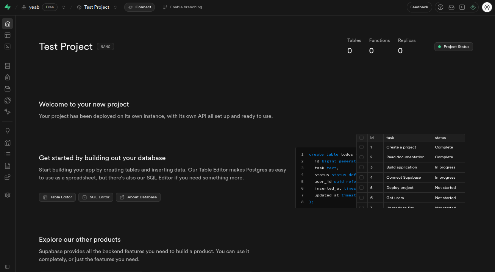

import { Tabs, TabsList, TabsTrigger, TabsContent } from "@/components/ui/tabs"

## Quick Start

Welcome to BetterBoilerplate! This guide will walk you through setting up your full-stack project step by step. 

**What you'll be setting up:**

- **🌐 Frontend** - Next.js web application
- **🗄️ Backend** - Express API server  
- **📝 CMS** - Content management system
- **🔐 Authentication** - Google OAuth + email login
- **💳 Payments** - Stripe integration
- **📧 Email** - Resend service
- **🤖 AI** - OpenRouter integration
- **🗃️ Database** - PostgreSQL with Supabase

<Info>
**Expected setup time:** 15-30 minutes depending on your familiarity with these services.
</Info>

---

## Prerequisites

Before you begin, make sure you have these installed:

* [Bun](https://bun.sh) v1.0+ (JavaScript runtime)
* [Git](https://git-scm.com/) (version control)
* [Node.js](https://nodejs.org/en) 18+ (if not using Bun)

---

## Step 1: Project Setup

### 1.1 Clone & Install

1. **Clone the repository:**
   ```bash
   # Using SSH (recommended)
   git clone git@github.com:Humanoidz-ai/ultimate-boilerplate-code.git
   
   # Or using HTTPS
   git clone https://github.com/Humanoidz-ai/ultimate-boilerplate-code.git
   ```

2. **Navigate to the project:**
   ```bash
   cd ultimate-cursor-ai-boilerplate
   ```

3. **Install dependencies:**
   ```bash
   bun install
   ```

### 1.2 Environment Files Setup

Create environment files from the provided examples:

```bash
cp apps/web/.env.example apps/web/.env
cp apps/cms/.env.example apps/cms/.env
cp apps/server/.env.example apps/server/.env
```

<Warning>
**Important:** You'll fill in these environment variables in the following steps. Don't worry about the values for now.
</Warning>

---

## Step 2: Database Setup (Supabase)

**What is Supabase?** It's your PostgreSQL database hosting service.

### 2.1 Create Main Database

1. **Go to [Supabase](https://app.supabase.com)** and sign up/login
   

2. **Create a new organization**
   

3. **Create a new project**
   - Choose a name for your project
   - **Important:** Save the database password - you'll need it later
   

4. **Get your database connection strings:**
   - Click "Connect" in the top center of your dashboard
   
   
   - Copy both connection strings:
     - **Transaction pooler** (for DATABASE_URL)
     - **Session pooler** (for DIRECT_URL)
   

5. **Add to `apps/server/.env`:**
   ```env
   DATABASE_URL=your_transaction_pooler_url
   DIRECT_URL=your_session_pooler_url
   ```

### 2.2 Create CMS Database

**Why a separate database?** The CMS needs its own database to keep content separate from your main app data.

1. **Create a second Supabase project** following the same steps above
2. **Get the connection string** (you only need one this time)
3. **Add to `apps/cms/.env`:**
   ```env
   DATABASE_URI=your_cms_database_url
   ```

---

## Step 3: Authentication Setup

**What is BetterAuth?** It handles user login/signup, sessions, and OAuth integrations.

### 3.1 Generate Authentication Secret

1. **Generate a secure secret:**
   ```bash
   openssl rand -hex 16
   ```

2. **Add to `apps/server/.env`:**
   ```env
   BETTER_AUTH_SECRET=your_generated_secret
   BETTER_AUTH_URL=http://localhost:3000
   CORS_ORIGIN=http://localhost:3001
   ```

### 3.2 Google OAuth Setup

**Why Google OAuth?** It allows users to sign in with their Google accounts.

1. **Visit [Google Cloud Console](https://console.cloud.google.com)**

2. **Create a new project** or select an existing one

3. **Enable Google+ API:**
   - Go to APIs & Services → Library
   - Search for "Google+ API" and enable it

4. **Set up OAuth credentials:**
   - Go to APIs & Services → Credentials
   - Create OAuth 2.0 Client ID
   - Set these values:
     - **Authorized JavaScript origins:** `http://localhost:3000`, `http://localhost:3001`
     - **Authorized redirect URIs:** `http://localhost:3000/api/auth/callback/google`

5. **Watch this helpful video for detailed setup:**
   <iframe width="560" height="315" src="https://www.youtube.com/embed/-vq32dsK_TI" title="YouTube video player" frameborder="0" allow="accelerometer; autoplay; clipboard-write; encrypted-media; gyroscope; picture-in-picture" allowfullscreen></iframe>

6. **Add to `apps/server/.env`:**
   ```env
   GOOGLE_CLIENT_ID=your_google_client_id
   GOOGLE_CLIENT_SECRET=your_google_client_secret
   ```

---

## Step 4: Email Service Setup (Resend)

**What is Resend?** It sends transactional emails like password resets and welcome emails.

### 4.1 Create Resend Account

1. **Visit [Resend](https://resend.com)** and sign up
2. **Create an API Key:**
   - Go to API Keys section
   - Click "Create API Key"
   - Copy the key (starts with `re_`)
   
   
   
   

3. **Add to `apps/server/.env`:**
   ```env
   RESEND_API_KEY=re_your_api_key
   ```

---

## Step 5: Payment Setup (Stripe)

**What is Stripe?** It handles all payment processing, subscriptions, and billing.

### 5.1 Basic Stripe Setup

1. **Visit [Stripe](https://stripe.com)** and login

2. **Enable Test Mode** (toggle in top right)
   
   

3. **Get your Secret Key:**
   - Go to Developers → API Keys
   - Copy the Secret Key (starts with `sk_test_`)
   
   
   

### 5.2 Create a Product

1. **Go to Products → Add Product**
2. **Set up your product details:**
   - Name (e.g., "Pro Subscription")
   - Price (e.g., $9.99/month)
   - Currency (USD)
   
   
   

3. **Copy the Price ID** (starts with `price_`)

4. **Add to `apps/server/.env`:**
   ```env
   STRIPE_SECRET_KEY=sk_test_your_secret_key
   STRIPE_TEST_PRODUCT=price_your_price_id
   ```

### 5.3 Webhook Setup (Optional but Recommended)

**Why webhooks?** They notify your app when payments succeed or fail.

1. **Install ngrok** (for local development):
   ```bash
   # Follow instructions at https://ngrok.com/
   ngrok http 3000
   ```

2. **In Stripe Dashboard:**
   - Go to Developers → Webhooks → Add Endpoint
   - Enter your ngrok URL: `https://your-ngrok-url.ngrok.io/api/webhooks/stripe`
   - Select events or choose "Send all events"
   
   
   

3. **Copy the Webhook Signing Secret and add to `apps/server/.env`:**
   ```env
   STRIPE_WEBHOOK_SECRET=whsec_your_webhook_secret
   ```

---

## Step 6: AI Integration (OpenRouter)

**What is OpenRouter?** It provides access to multiple AI models through a single API.

### 6.1 Get OpenRouter API Key

1. **Go to [OpenRouter](https://openrouter.ai/settings/keys)**
2. **Create a new API key**
3. **Copy the API key**


4. **Add to `apps/server/.env`:**
   ```env
   OPENROUTER_API_KEY=your_openrouter_api_key
   ```

---

## Step 7: CMS Secret Generation

**What is the CMS?** It's your content management system for blog posts, pages, etc.

### 7.1 Generate CMS Secret

1. **Generate a secure secret:**
   ```bash
   openssl rand -hex 32
   ```

2. **Add to `apps/cms/.env`:**
   ```env
   PAYLOAD_SECRET=your_generated_cms_secret
   ```

---

## Step 8: Frontend Configuration

**Configure the frontend app** to connect to your backend services.

### 8.1 Frontend Environment Variables

**Add to `apps/web/.env`:**
```env
NEXT_PUBLIC_SERVER_URL=http://localhost:3000
NEXT_PUBLIC_APP_URL=http://localhost:3001
PAYLOAD_PUBLIC_SERVER_URL=http://localhost:3003
```

---

## Step 9: Database Migration

**Set up your database tables** using Prisma (database toolkit).

### 9.1 Run Database Setup

```bash
# Navigate to server directory
cd apps

# Generate Prisma client (creates database connection code)
bun run db:generate

# Create initial migration (sets up database structure)
bun run db:migrate

# Push schema changes to database (applies the structure)
bun run db:push   
```

<Info>
**What these commands do:**
- `prisma generate`: Creates the database client code
- `prisma migrate dev`: Creates and applies database migrations
- `prisma db push`: Ensures all schema changes are applied
</Info>

---

## Step 10: Launch Your App! 🚀

### 10.1 Start All Services

Since this is a **turborepo** project, you can start all services with a single command:

```bash
# From the root directory
bun dev
```

This will automatically start:
- **Backend Server** on port 3000
- **Frontend App** on port 3001  
- **CMS** on port 3003

<Info>
**Turborepo Magic:** The `bun dev` command runs all three services in parallel automatically. You'll see logs from all services in one terminal window.
</Info>

### 10.2 Alternative: Individual Services

If you prefer to run services separately (for debugging or development), you can use individual terminals:

<details>
<summary>Click to see individual terminal commands</summary>

**Terminal 1 - Backend Server:**
```bash
cd apps/server
bun dev
```

**Terminal 2 - Frontend App:**
```bash
cd apps/web
bun dev
```

**Terminal 3 - CMS:**
```bash
cd apps/cms
bun dev
```

</details>

### 10.3 Access Your Apps

- **Frontend:** http://localhost:3001
- **Backend API:** http://localhost:3000
- **CMS:** http://localhost:3003

---

## Environment Variables Summary

Here's a complete overview of all the environment variables you should have configured:

<Tabs defaultValue="server">
  <TabsList>
    <TabsTrigger value="server">Server (.env)</TabsTrigger>
    <TabsTrigger value="web">Web (.env)</TabsTrigger>
    <TabsTrigger value="cms">CMS (.env)</TabsTrigger>
  </TabsList>

  <TabsContent value="server">
    ```env
    # Database
    DATABASE_URL=your_supabase_transaction_pooler_url
    DIRECT_URL=your_supabase_session_pooler_url

    # Authentication
    BETTER_AUTH_SECRET=your_generated_secret
    BETTER_AUTH_URL=http://localhost:3000
    CORS_ORIGIN=http://localhost:3001

    # Google OAuth
    GOOGLE_CLIENT_ID=your_google_client_id
    GOOGLE_CLIENT_SECRET=your_google_client_secret

    # Email
    RESEND_API_KEY=re_your_api_key

    # Payments
    STRIPE_SECRET_KEY=sk_test_your_secret_key
    STRIPE_TEST_PRODUCT=price_your_price_id
    STRIPE_WEBHOOK_SECRET=whsec_your_webhook_secret

    # AI
    OPENROUTER_API_KEY=your_openrouter_api_key
    ```
  </TabsContent>

  <TabsContent value="web">
    ```env
    NEXT_PUBLIC_SERVER_URL=http://localhost:3000
    NEXT_PUBLIC_APP_URL=http://localhost:3001
    PAYLOAD_PUBLIC_SERVER_URL=http://localhost:3003
    ```
  </TabsContent>

  <TabsContent value="cms">
    ```env
    DATABASE_URI=your_cms_supabase_url
    PAYLOAD_SECRET=your_generated_cms_secret
    ```
  </TabsContent>
</Tabs>

---

## Troubleshooting

### Common Issues

**🔥 "Database connection failed"**
- Double-check your Supabase connection strings
- Ensure your database is running
- Verify you copied the correct pooler URLs

**🔥 "Authentication not working"**
- Make sure your Google OAuth URLs are correct
- Check that your BETTER_AUTH_SECRET is properly set
- Verify Google+ API is enabled

**🔥 "Payments not processing"**
- Ensure you're in Stripe test mode
- Check that your webhook endpoint is correct
- Verify your product price ID is accurate

**🔥 "Port already in use"**
- Kill existing processes: `lsof -ti:3000 | xargs kill -9`
- Or use different ports in your environment variables

### Getting Help

- **Documentation:** Check the individual service docs
- **Community:** Join our Discord for support
- **Issues:** Report bugs on GitHub

---

## Next Steps

🎉 **Congratulations!** Your BetterBoilerplate is now running. Here's what you can do next:

1. **Customize the frontend** - Edit components in `apps/web/src/components`
2. **Add API endpoints** - Create new routes in `apps/server/src/routes`
3. **Configure CMS** - Add content types in `apps/cms/src/collections`
4. **Set up production** - Deploy to Vercel, Railway, or your preferred platform
5. **Add features** - Extend with additional integrations and functionality

**Happy building!** 🚀
